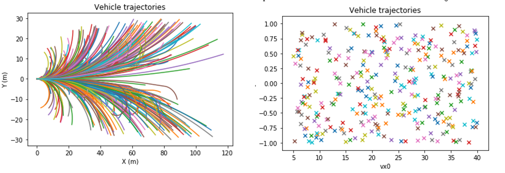
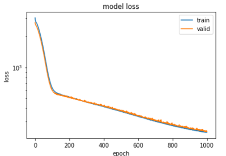
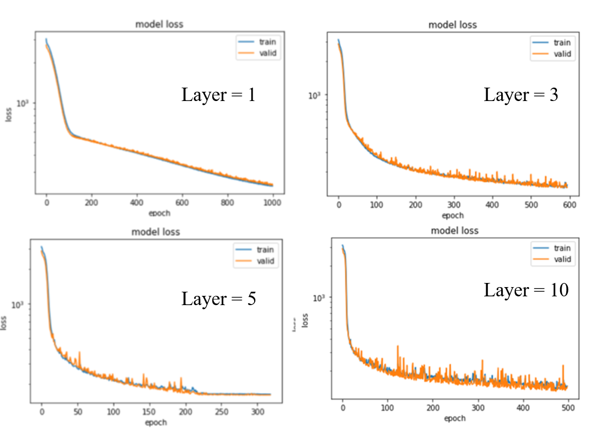
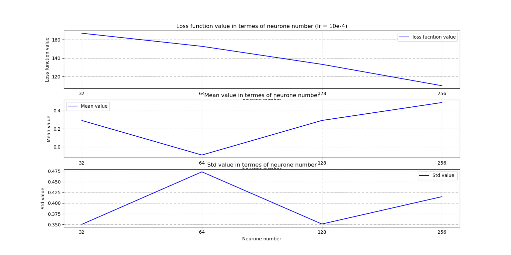
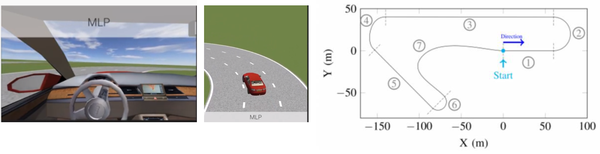

# Deep Learning for Vehicle Control (End-to-End Autonomous Driving)


This project presents the design and optimization of an **end-to-end learning-based vehicle control system**, where a neural network directly maps **vehicle states and reference trajectories to control commands**.

The objective is to learn a control strategy that enables **stable trajectory tracking** in a simulated autonomous driving environment.

This work was conducted at between the **Institute for Intelligent Systems and Robotics (ISIR), Sorbonne University** and **Mines Paris, PSL University**.

---

# Project Highlights

• End-to-end mapping from state → control using neural networks  
• Systematic model optimization via controlled experiments  
• Grid search for architecture tuning  
• Overfitting analysis using validation curves  
• Simulation-based validation of learned control policies  

---

# Overview

Traditional vehicle control relies on model-based approaches such as Proportional–Integral–Derivative (PID) control or Model Predictive Control (MPC).

In contrast, this project explores a data-driven alternative, where a neural network learns the control strategy directly from data.

The problem is formulated as a supervised learning task, where:

- Input: vehicle states (position, velocity, orientation) and reference trajectory
- Output: control commands (steering angle and acceleration command)

The objective is to approximate a mapping: (state, trajectory) → control, which enables **accurate and stable trajectory tracking**.

---

# Processing Pipeline

The overall workflow of the system can be summarized as:

Dataset → Preprocessing → Neural Network Model→ Training → Evaluation → Simulation

---

# Model Design

A **Multi-Layer Perceptron (MLP)** is used as the core Neural Network model.

The model is trained to minimize the difference between predicted and target control commands using Mean Squared Error (MSE) as the loss function.

The model is implemented as a fully connected neural network (MLP) with ReLU activations to capture nonlinear relationships between inputs and outputs.  
It produces continuous-valued control commands, making it suitable for regression-based control tasks.

At the core of the system, the model learns a direct mapping:

```
Vehicle State + Reference Trajectory
   ↓
Neural Network Model (MLP)
   ↓
Control Commands (steering, acceleration)
   ↓
Simulation Environment
```
---

# Training Workflow of the model

## Dataset Processing

The dataset is split into training, validation, and test sets to ensure proper evaluation.
All input features are normalized to improve training stability and convergence.
Each sample is constructed as an input-output pair, where vehicle states and reference trajectories are mapped to control commands.

Example trajectories from the training dataset are shown below:



## Experimental Methodology

To improve model performance, a systematic experimental methodology was designed. It involves controlled variable analysis and structured hyperparameter exploration.

### Learning Rate Stabilization

To balance convergence speed and stability:

- Fixed learning rates: 1e-3, 1e-4  
- Adaptive scheduling: ReduceLROnPlateau  

### Network Depth Exploration

- Depth range: 1–10 layers  
- Fixed width during experiments

Observation:

- Deeper networks → faster convergence  
- Too deep → instability and degraded performance  

### Network Width Exploration

- Width range: 32–256 neurons

Observation:

- Small models → underfitting  
- Large models → overfitting and unstable training

### Architecture Optimization (Grid Search)

To reduce search complexity, a two-stage grid search was applied:

- Stage 1: optimize early layers  
- Stage 2: refine deeper layers  

## Overfitting Mitigation

Overfitting was identified when validation loss increased while training loss decreased.

To address this issue, several techniques were applied:
- early stopping to prevent excessive training
- continuous monitoring of validation performance
- learning rate adjustment to stabilize training dynamics

---

# Experimental Results

## Training Behavior

The training process shows stable convergence and reduced oscillations after tuning.

Training Curves:



This figure shows the evolution of training and validation loss during optimization.
We observe stable convergence and improved generalization after tuning the learning rate.

## Model Comparison

Different architectures were evaluated to study the effect of depth and width.

The following figure compares models using different depths (layer numbers = 1,3,5,10) while keeping neuron width fixed.



It highlights the trade-off between model capacity and training stability:
deeper networks converge faster but may become unstable.

## Final Model Performance

The optimized architecture achieved the best trade-off between stability and accuracy.

Although larger models achieve lower loss, they also show increased variance and reduced stability, as shown in the following figure regarding the final Loss:



The final model achieves the lowest validation loss, indicating improved generalization performance.

The model with 256 neurons achieves the lowest loss, but also shows increased variance, indicating reduced stability.

The model with 128 neurons provides a better trade-off between accuracy and robustness.

The final architecture (64-128-64-128-128) was selected based on both performance and stability considerations.

Therefore, a moderately sized network was selected.

The selected architecture is a five-layer MLP with the following structure:
64 → 128 → 64 → 128 → 128 → output.

This result suggests that a moderately deep network provides the best trade-off between model capacity and training stability.

## Simulation Results

The trained model was deployed in a simulation environment.

Example of trajectory tracking is shown below:



The trained model demonstrates stable trajectory tracking in the simulation environment.
The generated control commands are smooth and consistent, without noticeable oscillatory behavior.

---

# Conclusion

This project demonstrates how neural networks can be used to learn vehicle control policies in an end-to-end manner.

Through systematic experimentation, we analyzed the impact of model architecture, learning rate strategies, and regularization techniques on training stability and generalization performance.

The results show that a properly tuned MLP can achieve stable trajectory tracking in simulation, highlighting the potential of learning-based approaches for control tasks.

Although simplified compared to full-scale autonomous driving systems, this project provides practical insights into the challenges of training neural network controllers, including overfitting, instability, and model selection.

---

# Technologies Used

## Programming

- Python  

## Machine Learning

- PyTorch / TensorFlow

## Tools

- NumPy  
- Matplotlib  

---

# Applications

Potential applications include:

- autonomous driving control  
- learning-based robotics control  
- imitation learning for dynamic systems

---

# Author

Zibo Zhang  
PhD in Robotics  
IMT Atlantique / Université Grenoble Alpes

